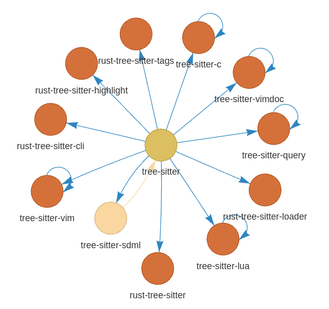

# Visual Excuses

Once a package is uploaded to the Ubuntu archive (dput) it triggers a series of tests and rebuilds across multiple packages in the archive.
Said package won't be able to migrate until it has build properly and all its dependencies have had successful tests

This is a very simple view but this is what we call package migration.

When a package doesn't migrate, one would wonder why? what is its excuse?

Browsing and looking at https://people.canonical.com/~ubuntu-archive/proposed-migration/update_excuses.html can give excellent insight and help resolve the problem right away but in a lot of case, it could take a long time to find why a package is not migrating due the amount of packages trying to migrate at the same time and blocking each others

Wouldn't it be great to have a visual representation of these excuses?

## introducing visual-excuses

This tool leverage the excuses database located here https://people.canonical.com/~ubuntu-archive/proposed-migration/update_excuses.yaml.xz

This tool also uses the package per team mapping relevant to Canonical's internal teams which could help to show excuses per team. The content comes from http://reqorts.qa.ubuntu.com/reports/m-r-package-team-mapping.html


Finally this python program leverage pyvis python library
https://github.com/WestHealth/pyvis
https://pyvis.readthedocs.io/en/latest/

## Installation

visual is available as a snap and installing it should be as simple as
```
$> snap install visual-excuses
```

Otherwise it can also be installer as a standard pip python package

```
$> git clone https://github.com/mclemenceau/visual-excuses.git
$> cd visual-excuses
$> pip3 install .
```

## Usage
Then run visual-excuses for all team or one specific team
```
$> visual-excuses
$> visual-excuses --team foundations-bugs
```
If you want to list available team
```
$> visual-excuses
$> visual-excuses --list-team
```

## Legend
Control are fairly intuitive with the mouse to zoom in and out of the picture

 - **Arrows** : go in the direction of the problem, follow the arrow to find the reason a package isn't migrating

 - **Orange items**: represents autopkgtest failures related excuses. Moving the mouse over the dot will show the exact failure and allow to click on hyperlink to go there.
 
 - **Yellow (ish) items** means another package autopkgtest failure is blocking the migration.

 - **Beige items** Blocked by another item, follow the arrow.
 
 - **White items** means the reason why it isn't migrating is unknown.
 
 - **Red items**: missing builds. moving the mouse over the dot will show which architecture are missings

 - Note: These colors choices may not always be ideal, might have to change them in the future.
 
## Pictures

Everything


Team view


A dependencie cluster around tree-sitter

